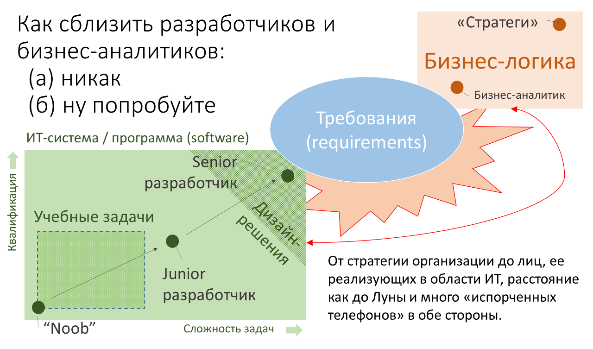

Информационные технологии (ИТ) для бизнес-аналитиков
====================================================

> [Сассман  признался, что вместе с коллегами по-прежнему не представляет себе, каким должен быть оптимальный план обучения.](https://habr.com/ru/post/282986/) 

Аудитория - бизнес-аналитики, которые работают в следующих сферах:

- связь бизнес-стратегии и развития ИТ систем или продуктов
- управление отдельными проектами (solution)
- управление организацией на основе данных, data governance

### Основная гипотеза

> Люди из бизнеса, прошедшие цикл (пере)подготовки в области программирования, разработки и ИТ архитектуры, лучше работают в командах и лучше выступают как заказчики ИТ-услуг. Это повышает эффективность бизнеса компании или организации в целом.

Хотя возможно она не верна: 

> А курс для разрабов или аналитиков? Просто ни аналитики не хотят быть разрабами, ни разрабы не пойдут в аналитику. (из переписки)

Подробнее о подходе к преподаванию [см. тут](intro.md).

Список тем
==========

1. [Программирование](#1-программирование)
2. [Работа с данными](#2-работа-с-данными)
3. [Процессы разработки и внедрения, DevOps](#3-процессы-разработки-и-внедрения-devops)
4. [ИТ-архитектура компании, связь бизнеса и ИТ](#4-ит-архитектура-компании-связь-бизнеса-и-ит)
5. [Персональная продуктивность](#5-персональная-продуктивность)
6. [Дополнительные темы и навыки](#дополнительные-темы-и-навыки)

## 1. Программирование

- Языки программирования и логика построения программ. 
- Практика программирования: цели, способы совершенствования, типовые сложности.
- Качество кода, рефакторинг, тестирование, документация.
- Алгоритмы, структуры данных и другие результаты из computer scicence.
- Абстракции, архитектура программ, паттерны. Интерфейсы программ (API).
- Процесс разработки ПО и продуктов, работа команд. Факторы успеха и экономика ИТ-проектов.

По программированию [есть детализация тем](programming.md). Ресурсы для новичков Python [тут](https://github.com/epogrebnyak/learn/blob/master/pure_python_guide.md).

## 2. Работа с данными

Практика:

- Машинно-читаемые форматы данных, сериализация.
- Базы данных, SQL, ORM. NoSQL/GraphQL.
- Визуализация данных - как рисовать картинки, дэшборды.
- Данные в исследованиях: immutable data/"source of truth", DAG.
- АPI получения данных. Примеры хранения (AWS S3). 

Состояние дел:

- Качество данных, data governance.
- Oфициальная статистика и данные в госорганах.
- Корпоративные системы (DWH, lake, mesh). 
- Data privacy, GDPR.

## 3. Процессы разработки и внедрения, DevOps

- Продукт
- Постановка задачи, спецификация, техническое задание.
- DDD и разные "cool-thing"-driven development
- Agile vs waterfall
- Типовые проблемы разработки и опыт работы команд
- Особенности взаимодействия (например, парное программирование)
- Работа фрилансера и с фрилансерами

#### DevOps

- version control (до-git, gitlab/github). Как написать хороший коммит.
- issue traker (Jira, etc)
- CI (travis, circle) / CD(heroku)
- infrastructure as code, AWS и аналоги, ainsible
- мониторинг
- "облако это чей-то компьютер"
- docker, vagrant

## 4. ИТ-архитектура компании, связь бизнеса и ИТ

- участники процесса (CIO, CDO, команды)
- build vs buy vs "buy-и-допилить"
- solution и enterprise архитектура 
- что понимают под цифровизацией
- (слабая) связь ИТ со стратегией
- успехи и провалы ИТ проектов, включая архитектуру
- основы бюджетирования проектов, статистика ИТ рынка

## 5. Персональная продуктивность

Базовые навыки:

- работа с командной строкой
- свой текстовой редактор (oт vim до VS-Code) 
- todo lists: todo.txt / trello / wip vs trying

Сервисы:

- сервисы AWS и аналоги
- jupyter notebook, binder

Документы:

- markdown (rst, asciidoc)
- plain text в git
- PDF/latex
- создание онлайн документации, учебников, статические генераторы сайтов

## 6. Дополнительные темы и навыки

- Распределенные системы, интеграция, мониторинг 
- Пользовательские интерфейсы (UI/UX)
- Технические диаграммы (UML, C4 model)
- Подходы к цифровизации
- Работа команд, коммуникаци
- Экономика ИТ компаний, затраты на ИТ в бизнесе
- Преподавание и электронные учебники (jupyter, colab, bookdown)

Не раскрыто, но хотелось бы в будущем:

- операционные системы
- безопасность
- словарь терминов
- больше примеров live coding

Cознательно пропускаем (разные причины):

- фронтэнд, javascript/node.js
- системное программирование
- криптография

Предыстория
-----------

Список основан на опыте преподавания и обсуждениях:

- курсов "Машинночитаемая корпоративная отчетность" (ЦМФ, 2018), 
- лекций "Введение в ИТ-архитектуру" (МГИМО, 2019)
- [обсуждение на митапе Московского клуба программистов 13.06.2019](https://speakerdeck.com/epogrebnyak/it-arkhitiektura-opyt-priepodavaniia)
